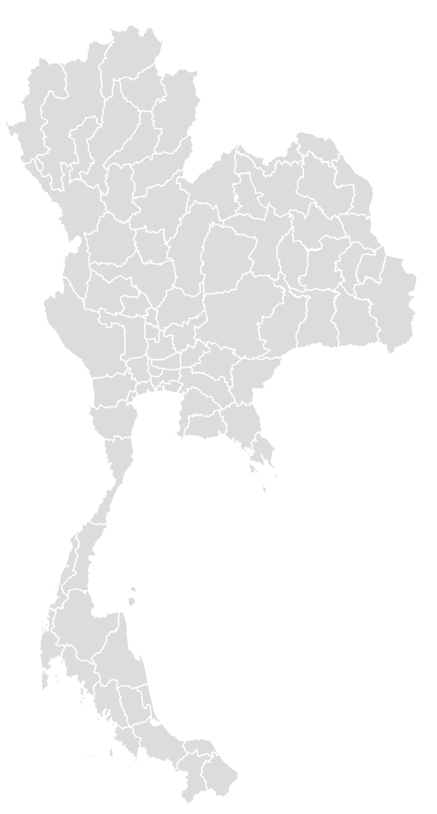
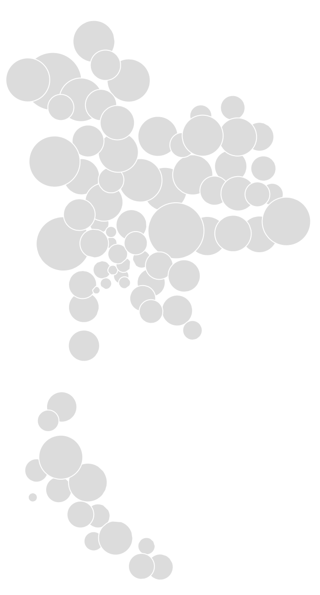

# geo2geo

The animated map of Thailand is at http://puripant.ruchikachorn.com/geo2geo/. Click on the map to morph between maps of geographical and geometric shapes. In this example, the size of a circle represents the area of each province.

How to run: Just use `http-server`

Related: https://github.com/sebastian-meier/d3.geo2rect
